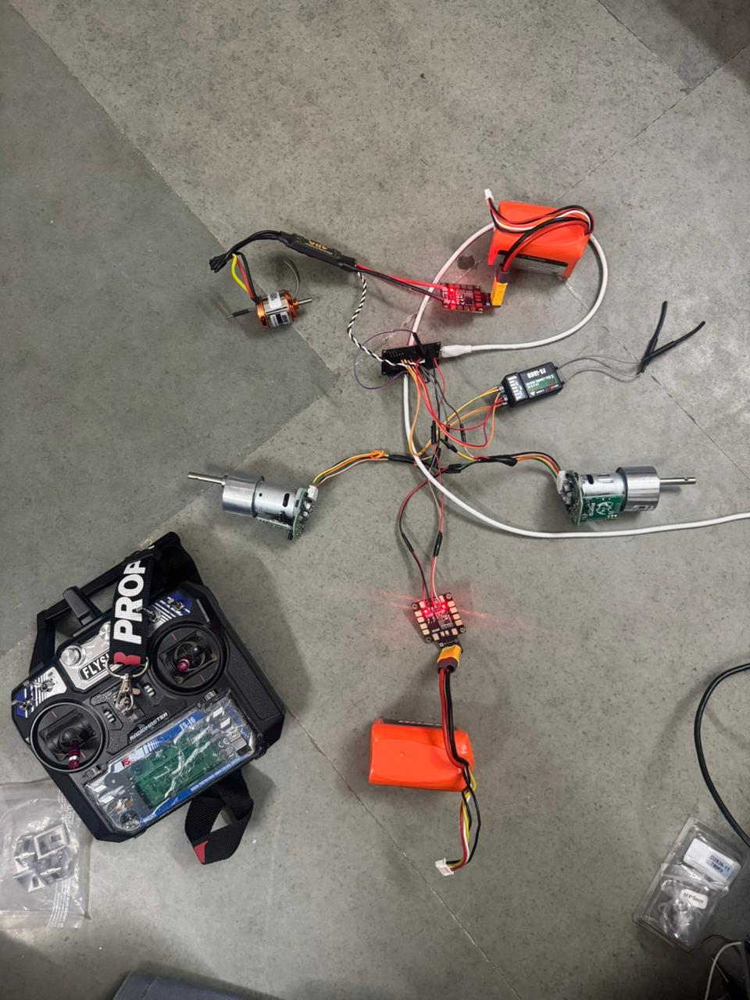

# Robowars — 7 kg Horizontal Spinner

A 7 kg, *Tombstone*-style horizontal spinner combat robot built for the **Robowars** event at
**Apogee**, BITS Pilani's annual technical festival.

I handled the project end to end — software, electronics, and build — including motor torque and
current-draw calculations, battery and ESC sizing, the control/drive firmware, and the fabrication
and assembly of the chassis and weapon.

---

## Design Overview

| | |
|---|---|
| **Weight class** | 7 kg |
| **Weapon type** | Horizontal spinning bar (Tombstone-style) |
| **Weapon material** | Mild steel bar — chosen for impact mass and durability |
| **Chassis** | All-aluminium — keeps the build light enough to spend weight on the weapon |
| **Drivetrain** | 2 × brushless DC motors (differential / tank steering) |
| **Weapon drive** | High-RPM brushless drone motor spinning the bar |
| **Controller** | ESP32 reading a 6-channel RC receiver |
| **Budget** | ₹25,000 |
| **Event** | Robowars @ Apogee, BITS Pilani |

The weight budget drove most of the build: an all-aluminium chassis frees up mass for a heavier
mild-steel spinning bar, putting more energy into each hit while staying under the 7 kg cap.

---

## Electronics & Control

The ESP32 reads six RC channels (standard 1000–2000 µs servo pulses) via `pulseIn`, applies tank
mixing for the drive, and outputs servo-style PWM (50 Hz) to the two drive ESCs and the weapon ESC.

### Channel map

| Channel | GPIO | Function |
|--------:|:----:|----------|
| CH1 | 35 | Throttle (forward / reverse) |
| CH2 | 34 | Turn (steering) |
| CH3 | 32 | Weapon speed |
| CH4 | 13 | Invert controls (self-rights drive when flipped) |
| CH5 | 33 | **Weapon kill** (SWA) |
| CH6 | 27 | **Drive kill** (SWD) |

### Outputs

| Output | GPIO |
|--------|:----:|
| Left drive motor ESC | 25 |
| Right drive motor ESC | 26 |
| Weapon ESC | 14 |

### Control logic

- **Tank mixing** — throttle and turn are combined into independent left/right motor commands
  (`left = throttle + turn`, `right = throttle - turn`), constrained and scaled to 90% to leave
  steering headroom at full throttle.
- **Invert mode** (CH4) — flips the throttle direction so the robot drives correctly when inverted;
  steering is left untouched because the physical flip already mirrors it.
- **Deadband** — small stick movements near centre are zeroed to stop motor whine.
- **Kill switches** — `Weapon kill` forces the weapon ESC to its disarmed pulse (1000 µs); `Drive
  kill` neutralises both drive motors (1500 µs). Both are independent safety overrides.
- **Failsafe** — any channel reading outside 900–2100 µs (e.g. signal loss) returns a centred
  1500 µs value.
- **Safe start** — on boot the drive motors are neutralised and the weapon is disarmed, followed by
  a 3 s ESC arming delay before the control loop runs.

---

## Firmware

The control firmware is a single Arduino sketch: [`robowar.ino`](robowar.ino).

### Requirements

- **ESP32** development board
- **Arduino IDE** with the **ESP32 board package v3.0.0 or newer**
  (the sketch uses the v3.x LEDC API: `ledcAttach(pin, freq, resolution)` and `ledcWrite(pin, duty)`)

> ⚠️ This will **not** compile on ESP32 core 2.x, which uses the older channel-based
> `ledcSetup` / `ledcAttachPin` API.

### Flashing

1. Install the ESP32 board package (3.x) via **Boards Manager**.
2. Open `robowar.ino`, select your ESP32 board and port.
3. Upload. The serial monitor (115200 baud) prints live channel and switch state for debugging.

---

## Safety

This is a combat robot with a high-energy steel spinner. Always:

- Keep the **weapon kill** and **drive kill** switches accessible and test them before every run.
- Arm the weapon only inside the arena / a safe enclosure.
- Verify failsafe behaviour (transmitter off → motors neutral, weapon disarmed) before competing.

---

## Gallery

A short demo and build photos are included in the repo:

- 🎥 **Demo video:** [WhatsApp Video 2026-04-15 at 8.53.38 PM.mp4](WhatsApp%20Video%202026-04-15%20at%208.53.38%20PM.mp4)
- 📸 Build photos: the `WhatsApp Image *.jpeg` files

| | |
|---|---|
|  |  |
|  |  |

---

## Repository contents

| File | Description |
|------|-------------|
| `robowar.ino` | ESP32 control firmware (drive mixing, weapon control, kill switches, failsafe) |
| `image.png` | Photo of the completed robot |
| `WhatsApp Video *.mp4` | Demo video |
| `WhatsApp Image *.jpeg` | Build and assembly photos |
| `Screenshot *.png` | Reference screenshot |
